# Bulk-RNA Seq Data Processing Pipeline using NextFlow / Docker
This is an automated workflow pipeline for analyzing and processing Bulk-RNA seq data, implemented primarily in bash, python and R, and wrapped in a NextFlow workflow to characterize the gene landscape in the samples. Here are the steps for data processing:
1. Quality Control - Generate FastQC and MultiQC reports
2. Genome Alignment - Map reads to the reference genome using STAR
2_1. Mapping Metrics - Generate mapping statistics and quality reports
3. RPost-Alignment Processing - Filter, deduplicate, and index aligned reads
3_1. Quality Assessment - Generate Qualimap reports for aligned reads
4. Transcript Assembly and Quantification - Generate counts using StringTie
5. Raw Count Generation - Generate raw counts using HTSeq && Feature Counts - Generate counts using Rsubread's featureCounts


Running the Bulk-RNA-Sequencing-Nextflow-Pipeline is pretty straight forward, however a good understanding of `bash` is recommended.

There are two ways to run the Bulk-RNA Seq pipeline: either by installing the necessary packages manually on the system, or by using a **Docker** container, where everything is pre-packaged. If you choose to use Docker, skip to the next section **Running the Tool in Docker**.

## Installation/Setup of Bulk-RNA Seq NextFlow Pipeline:
You can install Bulk-RNA Seq NextFlow Pipeline via git:
```
git clone https://github.com/utdal/Bulk-RNA-Seq-Nextflow-Pipeline.git
```

To execute the tool, essential modifications need to be made to the file(s):
```
a) pipeline.config
b) rna_seq_samples.txt
```

> Note:
> 1. Install [nextflow](https://www.nextflow.io/docs/latest/install.html), [conda](https://repo.anaconda.com/miniconda/Miniconda3-latest-Linux-x86_64.sh), [R](https://cran.r-project.org/) & [Rsubread-featureCounts](https://bioconductor.org/packages/release/bioc/html/Rsubread.html), [FastQC](https://www.bioinformatics.babraham.ac.uk/projects/fastqc/INSTALL.txt), [MultiQC](https://multiqc.info/docs/getting_started/installation/), [STAR](https://github.com/alexdobin/STAR), [HTSeq](https://anaconda.org/bioconda/htseq), [stringtie](https://ccb.jhu.edu/software/stringtie/), [samtools](https://gist.github.com/hisplan/541af29bb667066430e799ab8cde02d0), [sambamba](https://lomereiter.github.io/sambamba/), [bedtools](https://bedtools.readthedocs.io/en/latest/content/installation.html) and [qualimap](http://qualimap.conesalab.org/doc_html/intro.html) packages.
> 2. Or simply use the docker container instead from docker-hub: `docker pull`
> 
> Download the reference genome: `hg38canon.fa` and, to build the index, execute: `bowtie2-build hg38canon.fa /path/to/reference_genome/index/hg38`

#### Running the Tool:
Here is an example of how to run the pipeline:
1. Edit all the parameters, except for the clipping parameters in `pipeline.config` file:
   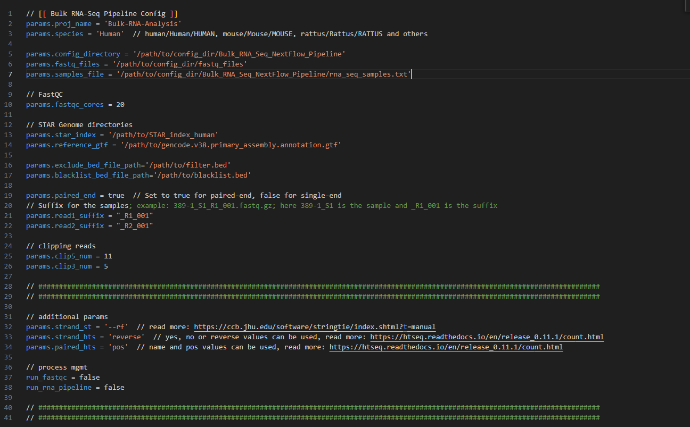

   > Note: Clipping parameters can only be updated once **Step-2** is run from the **FastQC** Reports.

2. Command to run the Quality Control steps in Bulk-RNA Seq analysis:
   ```
   nextflow run bulk_rna_seq_nextflow_pipeline.nf -c pipeline.config --run_fastqc true --run_rna_pipeline false
   ```
3. Update the `pipeline.config` file and run the rest of the pipeline:
   ```
   nextflow run bulk_rna_seq_nextflow_pipeline.nf -c pipeline.config --run_fastqc false --run_rna_pipeline true
   ```
4. Command to re-run the steps if a fail-point occurs:
   ```
   nextflow run bulk_rna_seq_nextflow_pipeline.nf -c pipeline.config --run_fastqc true --run_rna_pipeline false -resume
   ```
   or
   ```
   nextflow run bulk_rna_seq_nextflow_pipeline.nf -c pipeline.config --run_fastqc false --run_rna_pipeline true -resume
   ```
   respectively ...

The results generated are stored in the `params.config_directory = '/path/to/config'` directory, as mentioned in the `pipeline.config` file, as shown below:
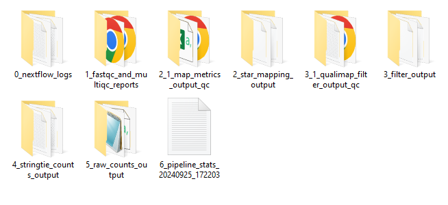

#### Running the Tool in Docker:
Running Bulk-RNA Seq in Docker is straightforward, here is an example of how to run the Bulk-RNA Seq pipeline using Docker.
1. Check if docker is already installed:
   ```
   docker --version
   ```
   Below are the required input and configuration files needed to run the tool:
   - pipeline.config
   - rna_seq_samples.txt
   
   The below files are user defined:
    - gencode.v38.primary_assembly.annotation.gtf
    - filter.bed
    - blacklist.bed
    - STAR_index
    - fastq_files

2. Place all the necessary files in the `config directory/data`, i.e., `/mnt/Working/BulkRNA-NextFlow-Pipeline/data` using docker volume
   > Note: The config directory in the docker image would be: `/mnt/Working/BulkRNA-NextFlow-Pipeline` and all the data that would be added via a docker volume mount would be accessible from the `data` directory (`/mnt/Working/BulkRNA-NextFlow-Pipeline/data`). Modify the `pipeline.config` file accordingly.
   1. Paired-end fastq files in a `fastq_files` directory.
   2. Bowtie2 genome index files in a directory (e.g., hg38`).
   3. Reference genome from NCBI in the `refdata-gex-GRCh38-2020-A` directory.
   4. `rna_seq_samples.txt` containing sample names without paired-end information.
   5. `pipeline.config` file containing paths to all the necessary files and the genome reference.

3. Run the docker image by setting up a working directory and mounting a volume where the input and configuration files are located.
   ```
   docker run -it -v /path/to/mount:/mnt/Working/Bulk_RNA_Seq_NextFlow_Pipeline/data -w /mnt/Working/Bulk_RNA_Seq_NextFlow_Pipeline utdpaincenter/bulk_rna_sequencing_nextflow_pipeline:latest /bin/bash
   ```
   > After entering the container; follow the following commands:
   > 1. Activate the working environment:
   >    ```
   >    conda activate bulk_rna_seq
   >    ```
   > 2. Run the nextflow pipeline:
   >    ```
   >    nextflow run bulk_rna_seq_nextflow_pipeline.nf -c data/pipeline.config --run_fastqc true --run_rna_pipeline false
   >    ```
   >    Modify pipeline.config file with the clipping parameters after the FastQC step and run the rest of the pipeline:
   >    ```
   >    nextflow run bulk_rna_seq_nextflow_pipeline.nf -c data/pipeline.config --run_fastqc false --run_rna_pipeline true
   >    ```
   > 3. If the pipeline encounters errors, dont worry—fix the issues and resume the process from the last checkpoint with:
   >    ```
   >    nextflow run bulk_rna_seq_nextflow_pipeline.nf -c data/pipeline.config --run_fastqc false --run_rna_pipeline true -resume
   >    ```
   
4. Once the run is completed, all output files will be copied back to the mounted volume to a `/outs` directory here: `/path/to/mount`


#### Output:
The output files are stored in the config directory or on the volume mount filepath based on how the pipeline is run; locally or using docker rrespectively. The output should contain the following files and folders:


# Pipeline Stages

| Step                             | Description                                             | Screenshot                                                                                                                 |
|----------------------------------|---------------------------------------------------------|----------------------------------------------------------------------------------------------------------------------------|
| 1. Logs                          | This step involves the collection of logs               | 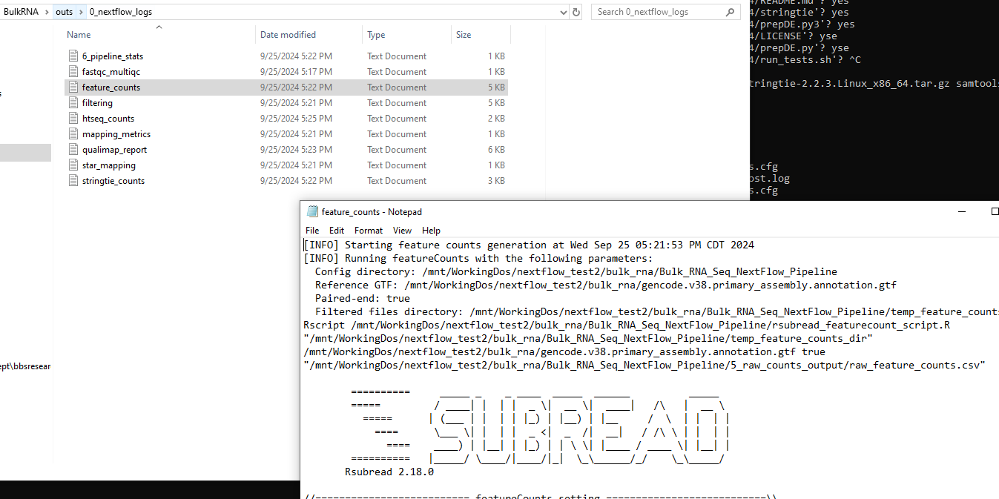                                                                                                 |
| 2. FastQC and MultiQC            | Quality check using FastQC and report using MultiQC     | 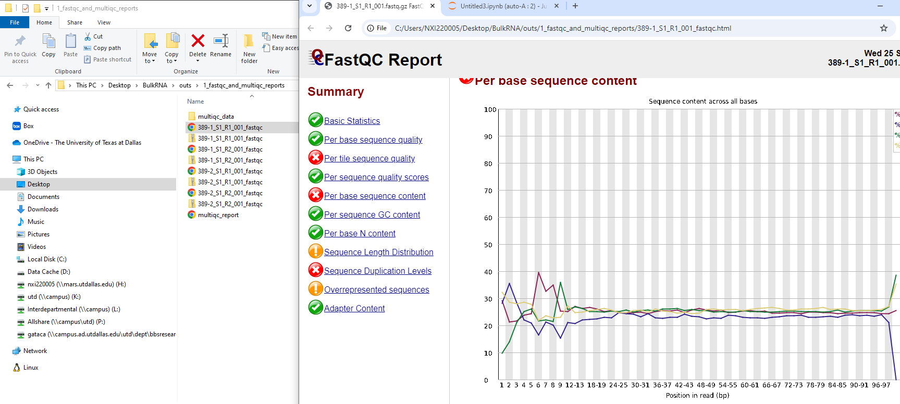 <br> 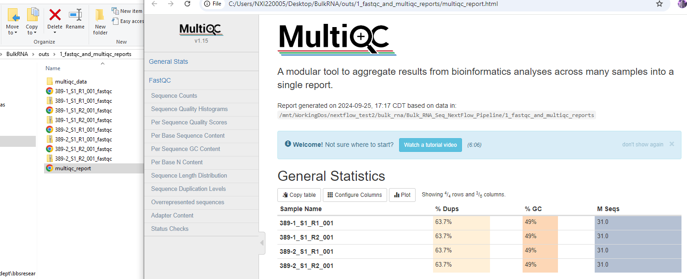                                                            |
| 3. Mapping and Map Metrics       | Alignment of reads and generation of mapping statistics | 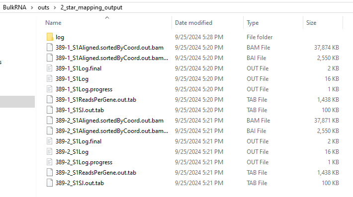 <br> 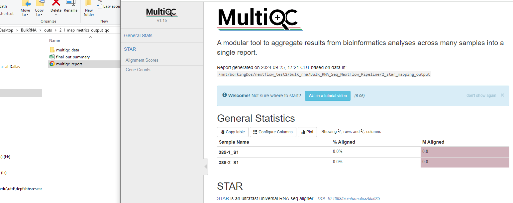                                                              |
| 4. Filtering and Quality Metrics | Post-alignment filtering and quality assessment         | 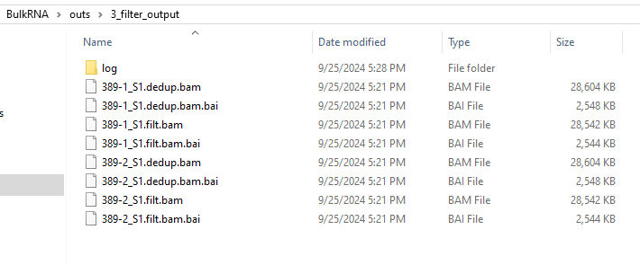 <br> 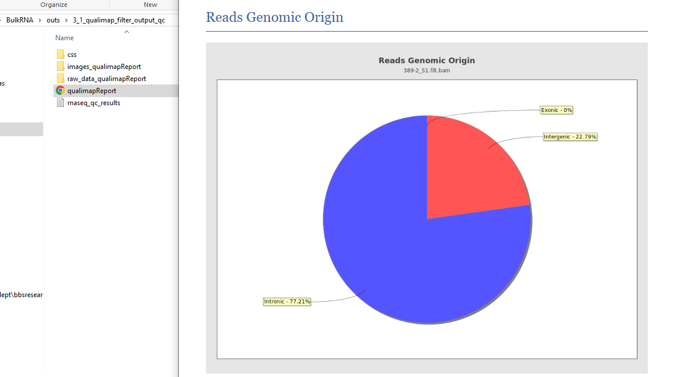                                                                |
| 5. StringTie and Raw Counts      | Counts using StringTie and FeatureCounts/HTSeq          | 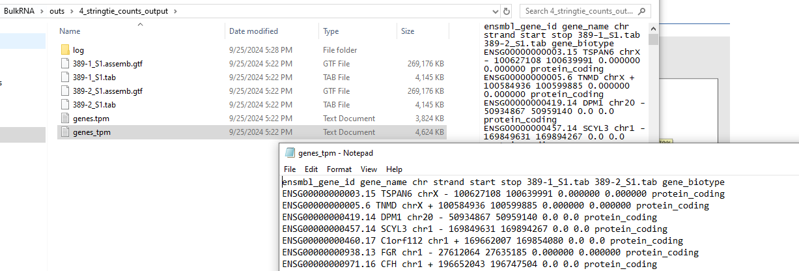 <br> 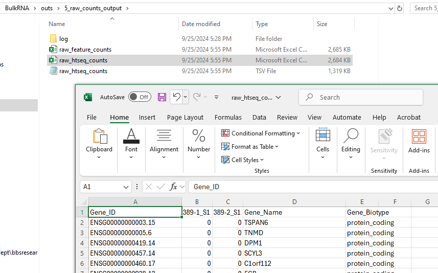 <br> 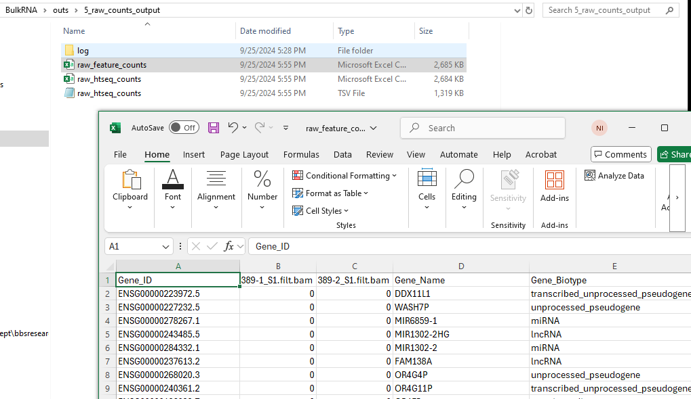 |


### Credits and Acknowledgments
This Bulk-RNA Seq Data Processing Pipeline was developed with contributions from the following team members:

- **Authors**:
  - Dr. Tavares Ferreira, Diana
  - Dr. Mazhar, Khadijah
  - [Inturi, Nikhil Nageshwar](https://github.com/unikill066) - inturinikhilnageshwar@gmail.com
